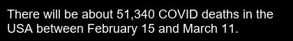
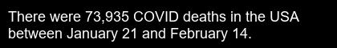
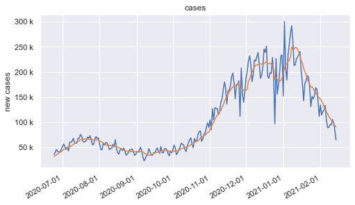
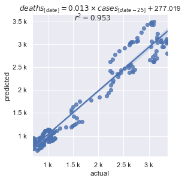

When this number

is less than this number

we will have started trending in the right direction.

# covid model

For the US data, cases reported today are an accurate predictor of deaths 21-28 days in the future.

## Rationale

The assumption is that the number of deaths today is a function of the number of cases discovered at some point in the past. Using [The COVID Tracking Project's](https://covidtracking.com/data) data and linear regression, find the best correlation between past cases and deaths at a future date.

## Cases

The prediction curves below are a linear function of cases, but offset by a number of days.

## Deaths

