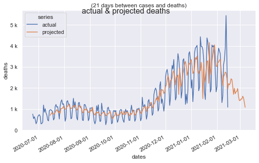
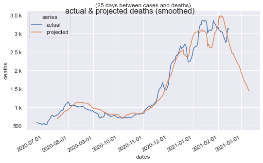

# covid model

Simple analysis and predictions of covid using python, jupyter, and sklearn.

## Rationale

The assumption is that the number of deaths today is a function of the number of cases discovered at some point in the past. Using [The COVID Track Project's](https://covidtracking.com/data) data and a simple linear regression, find the best correlation between past cases and deaths.

## Result

### Daily

### Smoothed

## Conclusion

For the US data set, cases discovered today are an accurate predictor of deaths 21-28 days in the future.
